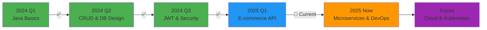

<div align="center">

# 🚀 Trần Quang Huy | FullStack Developer 🚀


[](https://github.com/chube-coder-2k4)
[](https://github.com/chube-coder-2k4)

</div>

---

<div align="center">

## 🌟 About Me 🌟

</div>


```yaml
name: Tran Quang Huy
located_in: Vietnam 🇻🇳
current_role: FullStack Developer
education: ["Computer Science", "Software Engineering"]
fields_of_interests:
  - Web Development
  - RESTful APIs
  - Microservices Architecture
  - Cloud Computing
  
currently_learning: ["Docker", "Kubernetes", "CI/CD", "AWS"]
hobbies: ["Coding 💻", "Reading 📚", "Coffee ☕"]
```

<br>

🔹 **Passionate FullStack Developer** specializing in **React** & **Spring Boot**  
🔹 Building **scalable**, **secure**, and **user-friendly** applications  
🔹 Strong expertise in **RESTful APIs**, **JWT Auth**, **OAuth2**, **RBAC**  
🔹 Database enthusiast: **PostgreSQL**, **MySQL**, **MongoDB**, **Redis**  
🔹 DevOps tools: **Docker**, **Git**, **Swagger**, **Postman**

---

<div align="center">

## 💎 Tech Stack & Skills 💎


</div>

### 🎨 Frontend Development
<p align="center">
  
  
  
  
  
  
  
  
</p>

### ⚙️ Backend Development
<p align="center">
  
  
  
  
  
  
</p>

### 🗄️ Database & Caching
<p align="center">
  
  
  
  
  
</p>

### 🛠️ DevOps & Tools
<p align="center">
  
  
  
  
  
  
</p>

---

<div align="center">

## 🎯 Featured Projects 🎯


</div>

### 🛒 Mini E-commerce API
<div align="center">


</div>

**🔗 [View Source Code](https://github.com/chube-coder-2k4/commerce-gateway-development)**

#### ✨ Key Features:
- 🔐 **JWT Authentication** with refresh token mechanism
- 👥 **Role-Based Access Control (RBAC)** - Admin, User, Seller roles
- 📧 **Email Verification** with OTP
- ⚡ **Redis Caching** for improved performance
- 🐰 **RabbitMQ Integration** for async messaging
- 📝 **Comprehensive API Documentation** with Swagger
- 🛡️ **Spring Security** implementation
- 🗄️ **PostgreSQL** for data persistence

<div align="center">
  
</div>

---

<div align="center">

## 📈 GitHub Statistics 📈


</div>

<div align="center">
  
  
</div>

<div align="center">
  
</div>

<div align="center">
  
</div>

---

<div align="center">

## 🛣️ Learning Roadmap 🛣️

</div>


```mermaid
graph LR
    A[2024 Q1<br/>Java Basics] -->|✅| B[2024 Q2<br/>CRUD & DB Design]
    B -->|✅| C[2024 Q3<br/>JWT & Security]
    C -->|✅| D[2025 Q1<br/>E-commerce API]
    D -->|🔄 Current| E[2025 Now<br/>Microservices & DevOps]
    E --> F[Future<br/>Cloud & Kubernetes]
    
    style A fill:#4CAF50
    style B fill:#4CAF50
    style C fill:#4CAF50
    style D fill:#2196F3
    style E fill:#FF9800
    style F fill:#9C27B0
```

| 📅 Timeline | 🎯 Focus Area | 📊 Status |
|------------|--------------|----------|
| 2024 Q1 | Java & Spring Boot Fundamentals | ✅ Completed |
| 2024 Q2 | CRUD Applications & Database Design | ✅ Completed |
| 2024 Q3 | JWT Authentication & Spring Security | ✅ Completed |
| 2025 Q1 | Mini E-commerce API (FullStack) | ✅ Completed |
| **2025 Now** | **Microservices Architecture & DevOps** | 🔄 **In Progress** |
| 2025 Q3+ | Kubernetes, AWS Cloud, CI/CD Pipeline | 📋 Planned |

---

<div align="center">

## 💭 Dev Wisdom 💭


</div>

<div align="center">
  
</div>

---

<div align="center">

## 🤝 Connect With Me 🤝


[](https://github.com/chube-coder-2k4)
[](https://www.linkedin.com/in/your-linkedin/)
[](mailto:qhuyddbmt123@gmail.com)
[]([https://facebook.com/your-profile](https://www.facebook.com/tran.quang.huy.948024))

</div>

---

<div align="center">

### 💖 Thanks for visiting! 💖

 &nbsp; **Show some ❤️ by starring some of my repositories!** &nbsp; 


</div>

---

<div align="center">

**💻 Crafted with 💙 by Tran Quang Huy**


</div>
